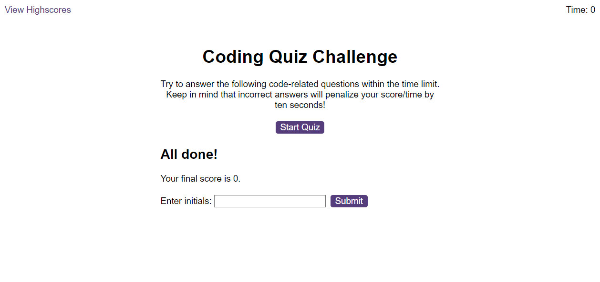

# Coding Quiz

## Description

This page runs a JavaScript that displays multi-choice questions to the user. The quiz is timed. If an incorrect answer is given, the remaining time is reduced. If all the questions are answered, or the timer runs out, the quiz ends and the user is displayed their time and asked if they wish to record their time.
 
## Table of Contents

* [Links](#links)
* [Installation](#installation)
* [Usage](#usage)
* [Screenshots](#screenshots)
* [License](#license)
* [Features](#features)

## Links

- [Repo](https://github.com/cadbuckle/codingquiz)
- [Live](https://cadbuckle.github.io/codingquiz/)

## Installation

The questions are held in an array in the questions.js file.
The highscores are recorded locally in the browser.

## Usage 
### To Play The Quiz
After the page is displayed, clicking the "Start Quiz" button will display the first question and start the timer.
The user has to select one option from each question.
If an incorrect answer is selected, 10 seconds are taken off the time and the next question is displayed.
When all the questions have been answered, or the time runs out, the user will be displayed their final time (score).
If the user wishes to record their time, they enter their initials and click the Submit button.
### Highscores
The Highscores can be viewed by clicking the "View Highscores" link in the top left hand corner.
This will display all the scores that have been saved using this browser.
Selecting the Clear Highscores button will reset all the data.
The Go Back button will return to the previous screen.

## Screenshots
### Start Screen
</img>
### Example of quiz question
</img>
### End of quiz screen
</img>
### Highscores screen
</img>

## License

MIT License as per repository.

## Features

JavaScript, notably:
- Events & Timers: to trigger events
- Arrays: for holding the questions and answers.
- DOM: dynamic alteration of display to show question and answers.
- Local Storage: for recording the highscores.

## Acknowledgements

Thanks to:
* Bootcamp Lessons
* W3 Schools
* MDN

© 2023 edX Boot Camps LLC. Confidential and Proprietary. All Rights Reserved.
